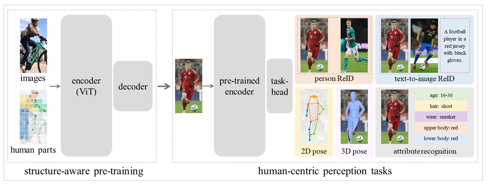

# HAP

## 📚 Contents
- [HAP](#hap)
  - [📚 Contents](#-contents)
  - [📋 Introduction](#-introduction)
  - [📂 Datasets](#-datasets)
  - [🛠️ Environment](#️-environment)
  - [🚀 Get Started](#-get-started)
  - [🏆 Results](#-results)
  - [💗 Acknowledgement](#-acknowledgement)
  - [✅ Citation](#-citation)
  - [🤝 Contribute \& Contact](#-contribute--contact)

## 📋 Introduction
This repository contains the implementation code for paper:

**HAP: Structure-Aware Masked Image Modeling for Human-Centric Perception**

*Advances in Neural Information Processing Systems (NeurIPS) 2023*

[[arXiv](https://arxiv.org/abs/2310.20695)] &#8194; [[project page](https://zhangxinyu-xyz.github.io/hap.github.io/)]

  HAP is the first masked image modeling framework for human-centric pre-training. It leverages body structure-aware training to learn general human visual representations. It achieves SOTA performance across several human-related benchmarks. 




## 📂 Datasets

**Pre-Training Data**

We use [LUPerson](https://github.com/DengpanFu/LUPerson) for pre-training. To make the pre-training more efficient, we only use half of the dataset with a list named "CFS_list.pkl" from [TransReID-SSL](https://github.com/damo-cv/TransReID-SSL). To extract the keypoint information of data, which is the masking guidance during pre-training, [ViTPose](https://github.com/ViTAE-Transformer/ViTPose) is used to perform inference on LUPerson. You can download our pose dataset [here](https://drive.google.com/file/d/1YC_imlL3cIbtXVL2y3p7iE0yCdnSBWrO/view?usp=sharing). 

Put the dataset directories outside the HAP project:
```bash
root
├── HAP
├── LUPerson-data  # LUPerson data
│   ├── xxx.jpg
│   └── ...
└── LUPerson-pose  # LUPerson with pose keypoints
    ├── xxx.npy
    └── ...
```

## 🛠️ Environment
Conda is recommended for configuring the environment:
```bash
conda env create -f env-hap.yaml && conda activate env_hap
```

## 🚀 Get Started

The default setting for pre-training is 400 epochs with total batch-size of 4096.

It may need 32 GPUs with memory larger than 32GB, such as NVIDIA V100, for pre-training.

```bash
# -------------------- Pre-Training HAP on LUPerson --------------------
cd HAP/

MODEL=pose_mae_vit_base_patch16

# Download official MAE model pre-trained on ImageNet and move it here
CKPT=mae_pretrain_vit_base.pth

# Download cfs list and move it here
CFS_PATH=cfs_list.pkl

OMP_NUM_THREADS=1 python -m torch.distributed.launch \
    --nnodes=${NNODES} \
    --node_rank=${RANK} \
    --master_addr=${ADDRESS} \
    --master_port=${PRETRAIN_PORT} \
    --nproc_per_node=${NPROC_PER_NODE} \
    main_pretrain.py \
    --dataset LUPersonPose \
    --data_path ../LUPerson-data \
    --pose_path ../LUPerson-pose \
    --sample_split_source ${CFS_PATH} \
    --batch_size 256 \
    --model ${MODEL} \
    --resume ${CKPT} \
    --ckpt_pos_embed 14 14 \
    --mask_ratio 0.5 \
    --align 0.05 \
    --epochs 400 \
    --blr 1.5e-4 \
    --ckpt_overwrite \
    --seed 0 \
    --tag default
```

## 🏆 Results

We evaluate HAP for the following downstream tasks. Click them to find implementation instructions.

- [Person ReID](downstream_tasks/person_reid/README.md)
- [Text-to-Image ReID](downstream_tasks/text_to_image_person_reid/README.md)
- [2D Pose estimation](downstream_tasks/2d_pose_estimation/README.md)
- [3D Pose and Shape Estimation](downstream_tasks/3d_pose_estimation/README.md)
- [Pedestrian Attribute Recognition](downstream_tasks/pedestrian_attribute_recognition/README.md)

You can download the checkpoint of the pre-trained HAP model [here](https://drive.google.com/file/d/1_7EKcBKMwDWx5xLv5fK0_HcUB-0Yqa0t/view?usp=sharing).
The results are given below.

| task | dataset | resolution | structure | result |
| --- | --- | --- | --- | --- |
| Person ReID | MSMT17 | (256, 128) | ViT | 76.4 (mAP) |
| Person ReID | MSMT17 | (384, 128) | ViT | 76.8 (mAP) |
| Person ReID  | MSMT17 | (256, 128) | ViT-lem | 78.0 (mAP) |
| Person ReID | MSMT17 | (384, 128) | ViT-lem | 78.1 (mAP) |
| Person ReID | Market-1501 | (256, 128) | ViT | 91.7 (mAP) |
| Person ReID | Market-1501 | (384, 128) | ViT | 91.9 (mAP) |
| Person ReID | Market-1501 | (256, 128) | ViT-lem | 93.8 (mAP) |
| Person ReID | Market-1501 | (384, 128) | ViT-lem | 93.9 (mAP) |

| task | dataset | resolution | training | result |
| --- | --- | --- | --- | --- |
| 2D Pose Estimation | MPII | (256, 192) | single-dataset | 91.8 (PCKh) |
| 2D Pose Estimation | MPII | (384, 288) | single-dataset | 92.6 (PCKh) |
| 2D Pose Estimation | MPII | (256, 192) | multi-dataset | 93.4 (PCKh) |
| 2D Pose Estimation | MPII | (384, 288) | multi-dataset | 93.6 (PCKh) |
| 2D Pose Estimation | COCO | (256, 192) | single-dataset | 75.9 (AP) |
| 2D Pose Estimation | COCO | (384, 288) | single-dataset | 77.2 (AP) |
| 2D Pose Estimation | COCO | (256, 192) | multi-dataset | 77.0 (AP) |
| 2D Pose Estimation | COCO | (384, 288) | multi-dataset | 78.2 (AP) |
| 2D Pose Estimation | AIC | (256, 192) | single-dataset | 31.5 (AP) |
| 2D Pose Estimation | AIC | (384, 288) | single-dataset | 37.7 (AP) |
| 2D Pose Estimation | AIC | (256, 192) | multi-dataset | 32.2 (AP) |
| 2D Pose Estimation | AIC | (384, 288) | multi-dataset | 38.1 (AP) |

| task | dataset | result |
| --- | --- | --- |
| Pedestrian Attribute Recognition | PA-100K | 86.54 (mA) |
| Pedestrian Attribute Recognition | RAP | 82.91 (mA) |
| Pedestrian Attribute Recognition | PETA | 88.36 (mA) |

| task | dataset | result |
| --- | --- | --- |
| Text-to-Image Person ReID | CUHK-PEDES | 68.05 (Rank-1) |
| Text-to-Image Person ReID | ICFG-PEDES | 61.80 (Rank-1) |
| Text-to-Image Person ReID | RSTPReid | 49.35 (Rank-1) |

| task | dataset | result |
| --- | --- | --- |
| 3D Pose Estimation | 3DPW | 90.1 (MPJPE), 56.0 (PA-MPJPE), 106.3 (MPVPE) |

## 💗 Acknowledgement

We acknowledge the following open source projects.

- Model: &#8194; [MAE](https://github.com/facebookresearch/mae) &#8194; 
[MALE](https://github.com/YanzuoLu/MALE) &#8194;
[BEiT](https://github.com/microsoft/unilm/tree/master/beit) &#8194;
- Dataset: &#8194; [LUPerson](https://github.com/DengpanFu/LUPerson) &#8194; [TransReID-SSL](https://github.com/damo-cv/TransReID-SSL) &#8194; [ViTPose](https://github.com/ViTAE-Transformer/ViTPose) &#8194;
- Downstream evaluation: &#8194; [MALE](https://github.com/YanzuoLu/MALE) &#8194; [ViTPose](https://github.com/ViTAE-Transformer/ViTPose) &#8194; [mmcv](https://github.com/open-mmlab/mmcv)  &#8194; [mmpose](https://github.com/open-mmlab/mmpose) &#8194;  [Rethinking_of_PAR](https://github.com/valencebond/Rethinking_of_PAR) &#8194; [LGUR](https://github.com/ZhiyinShao-H/LGUR) &#8194; [3DCrowdNet](https://github.com/hongsukchoi/3DCrowdNet_RELEASE)
- Else: &#8194; [Swin](https://github.com/microsoft/Swin-Transformer) &#8194;

## ✅ Citation

```bash
@article{yuan2023hap,
  title={HAP: Structure-Aware Masked Image Modeling for Human-Centric Perception},
  author={Yuan, Junkun and Zhang, Xinyu and Zhou, Hao and Wang, Jian and Qiu, Zhongwei and Shao, Zhiyin and Zhang, Shaofeng and Long, Sifan and Kuang, Kun and Yao, Kun and others},
  journal={arXiv preprint arXiv:2310.20695},
  year={2023}
}
```

## 🤝 Contribute & Contact

Feel free to star and contribute to our repository. 

If you have any questions or advice, contact us through GitHub issues or email (yuanjk0921@outlook.com).